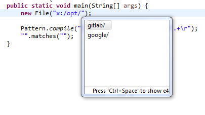
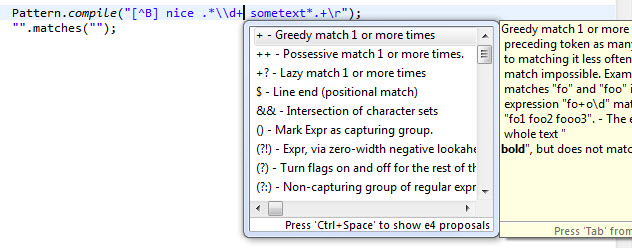
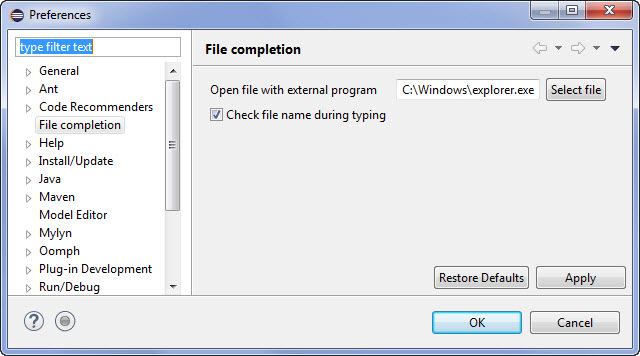

eclipse-filecompletion
======================

File names completion Eclipse plugin

Provides features:

*   File name completion for expression like `new File("c:/")`
*   Open file from above expression in eclipse (Shift-F6)  and external viewer (Shift-F7). External viewer need specify in properties.
*   Validate file name during typing (Need enable in config)
*   Regular expression assist helper for expression like :
    `Pattern.compile("[^B] nice")` ,
    `"some text".matches("RegExp")` ,
    `"some text".replaceFirst("RegExp","toText")` ,
    `"some text".replaceAll("RegExp","toText")`

###  Download
[Download plugin](http://raw.githubusercontent.com/impetuouslab/eclipse-filecompletion/propose1/update-site/plugins/org.impetuouslab.eclipse.filecompletion_0.0.1.201601191422.jar) 

### Screenshots
File completion assist :

 
Regualr expression assist :

Properties :

 
 